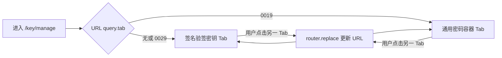
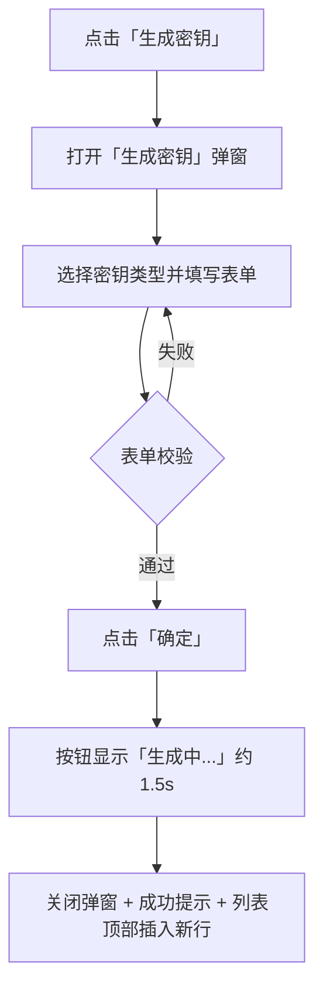
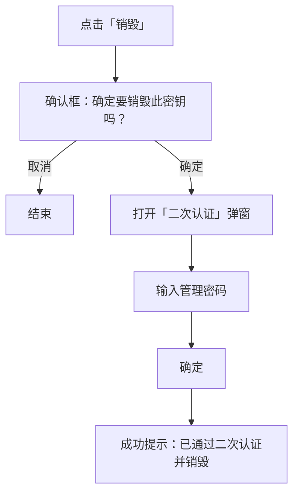
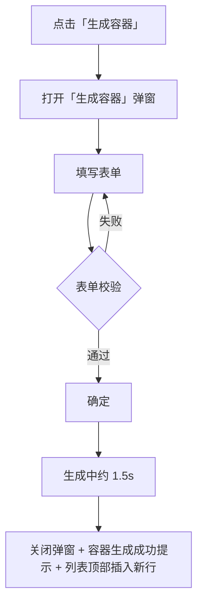
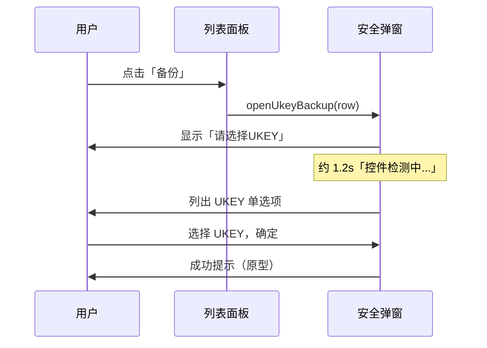
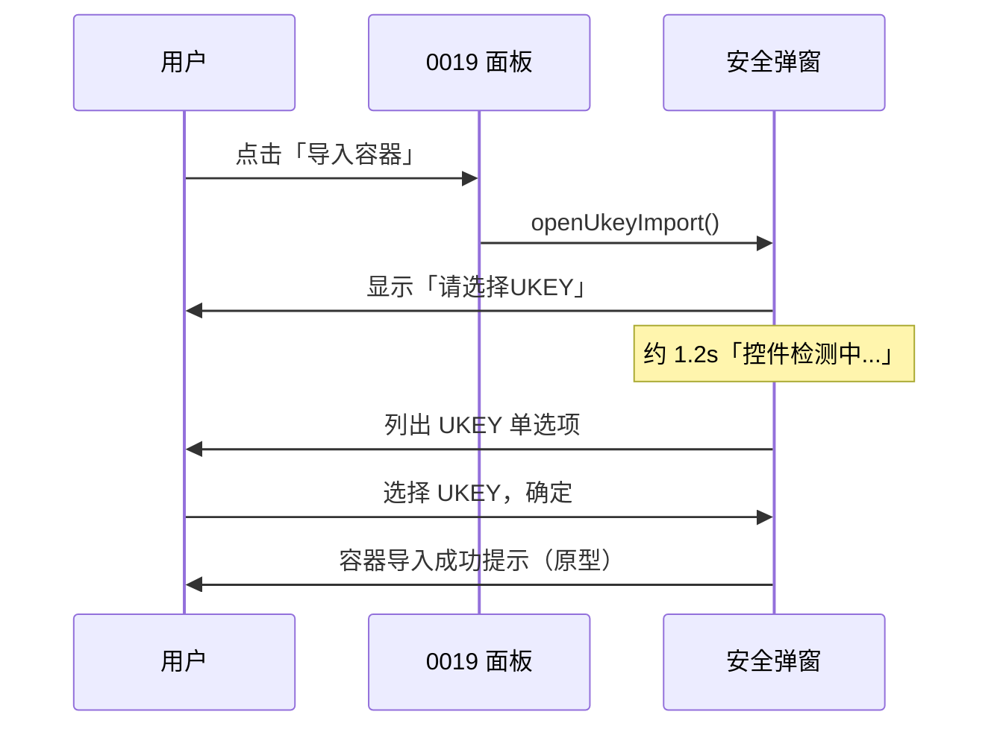

# 密钥管理 — 用户操作流程

> **文档版本**：与当前原型代码一致（`src/views/key/`）  
> **适用路由**：`/key/manage`（Hash 路由下为 `#/key/manage`）  
> **说明**：本系统为界面原型，部分操作仅提示成功/演示信息，未对接真实密码设备或后端 API。

---

## 1. 功能入口与页面结构

### 1.1 进入路径

| 步骤 | 用户操作 | 系统响应 |
|------|----------|----------|
| 1 | 在左侧菜单点击 **「签名验签服务」** 展开子菜单 | 显示子菜单项 |
| 2 | 点击 **「密钥管理」**（菜单项旁带红色 **「新」** 角标，标识 1.8.0 新增/改版能力） | 进入密钥管理页，默认展示 **「签名验签密钥」** Tab |
| 3 | （可选）通过 URL 参数切换规范 | `?tab=0019` 打开 **「通用密码容器」** Tab；无参数或 `?tab=0029` 为签名验签密钥 |

**侧栏「新」角标说明**（与密钥管理相关）：

| 位置 | 含义 |
|------|------|
| 签名验签服务 → **密钥管理** | 本模块为 1.8.0 重点改版入口 |
| 页面 Tab **通用密码容器** | GM/T 0019 容器管理，标注 **V1.9.1** |
| 生成密钥 → **IBC体系密钥** 分组 | SM9 三类密钥；分组标题保留 **IBC体系密钥**，旁附 **V1.9.1** 角标；选中 SM9 类型时表单项「密钥类型」标签亦显示 **V1.9.1** |

**顶栏面包屑**（随 Tab 变化）：

- 签名验签密钥：`签名验签服务 / 密钥管理 / 签名验签服务器技术规范`
- 通用密码容器：`签名验签服务 / 密钥管理 / 通用密码服务接口规范`

### 1.2 页面整体布局

```
┌─────────────────────────────────────────────────────────┐
│  顶栏面包屑                                               │
├─────────────────────────────────────────────────────────┤
│  [ 签名验签密钥 ]  [ 通用密码容器 V1.9.1 ]   ← Tab 切换        │
├─────────────────────────────────────────────────────────┤
│  （当前 Tab 对应的面板内容：筛选区 / 操作栏 / 表格 / 分页）   │
│  + 全局安全类弹窗（UKEY 备份/导入、二次认证，两 Tab 共用）      │
└─────────────────────────────────────────────────────────┘
```

**对应源码**：

| 模块 | 文件 |
|------|------|
| 页面壳、Tab、面包屑 | `src/views/key/KeyManage.vue` |
| 0029 签名验签密钥 | `src/views/key/KeyManage0029Panel.vue` |
| 0019 通用密码容器 | `src/views/key/KeyManage0019Panel.vue` |
| UKEY 备份/导入、二次认证 | `src/views/key/KeyManageSecurityModals.vue` |
| 侧栏菜单与「新」角标 | `src/components/layout/Sidebar.vue` |

---

## 2. Tab 切换流程



| 用户操作 | 结果 |
|----------|------|
| 点击 **「签名验签密钥」** | 展示 0029 面板；URL 去掉 `tab` 或保持 0029 |
| 点击 **「通用密码容器」**（带 **V1.9.1** 角标） | 展示 0019 面板；URL 变为 `?tab=0019` |
| 浏览器前进/后退或手动改 URL | Tab 与 URL 同步 |

---

## 3. 签名验签密钥（GM/T 0029）操作流程

对应规范语境：**签名验签服务器技术规范（GM/T 0029-2014）** 原型。

### 3.1 列表查询与重置

**界面区域**：页面上方白色筛选条 + **查询** / **重置** 按钮。

| 筛选项 | 类型 | 说明 |
|--------|------|------|
| 密钥 ID | 文本输入 | 模糊包含匹配 |
| 密码算法 | 下拉 | 全部 / SM2 / RSA / **SM9** / **PQC 算法**（ML_DSA_44/65/87、SLH_DSA 系列、AIGIS_SIG、LMS_SM3 等）/ SM4 / 3DES / AES |
| 密钥用途 | 下拉 | 全部 / 签名验签 / 加密解密 |
| 添加时间 | 日期时间范围 | 起止时间戳筛选 |

| 用户操作 | 系统响应 |
|----------|----------|
| 填写条件后点击 **「查询」** | 按条件过滤列表，页码回到第 1 页 |
| 点击 **「重置」** | 清空全部筛选条件，页码回到第 1 页 |

**列表列**：密钥索引、密钥 ID、密钥算法、密钥用途、密钥长度、添加时间、操作。

**分页**：支持每页 10 / 20 / 50 条，底部分页器切换页码。

### 3.2 生成密钥

工具栏 **「生成密钥」** 按钮旁带红色 **「新」** 角标，表示生成能力已扩展。



#### 3.2.1 密钥类型（新增，带「新」角标）

下拉按分组展示，切换类型后表单字段与默认值联动：

| 分组 | 可选类型 | 版本标注 |
|------|----------|----------|
| PKI 体系密钥 | SM2 密钥、RSA | — |
| 对称密钥体系 | SM4、3DES、AES | — |
| IBC 体系密钥 | SM9 主密钥、SM9 标识密钥、SM9 分片主密钥 | 分组标题 **IBC体系密钥** + **V1.9.1** |
| PQC 体系密钥 | ML_DSA_44/65/87、SLH_DSA_SHA2 系列、AIGIS_SIG1/2/3、LMS_SM3 系列等 | — |

#### 3.2.2 各类型表单项

**PKI / 对称密钥（SM2、RSA、SM4、3DES、AES）**

| 表单项 | 必填 | 规则与联动 |
|--------|------|------------|
| 密钥类型 | 是 | 见上表分组 |
| 密钥用途 | 是 | 多选：签名验签、加密解密；至少选一项 |
| 密钥长度 | 是 | SM2→256，RSA→2048，SM4→128，3DES→168，AES→128 |
| 密钥访问口令 | 是 | 6～32 字符 |

**算法联动**：

- 选择 **SM4 / 3DES / AES**（对称算法）时：**「签名验签」** 复选框禁用，用途自动变为仅 **「加密解密」**。
- 切换密钥类型时，密钥长度自动调整为该类型默认值。

**IBC 体系（SM9）**

| 子类型 | 额外必填项 | 说明 |
|--------|------------|------|
| SM9 主密钥 | 密钥长度（256）、参数域名、参数版本 | 参数域名在系统内唯一；有 tooltip 说明 |
| SM9 标识密钥 | 私钥标识、主密钥（下拉，选自已有主密钥） | 须先存在 SM9 主密钥 |
| SM9 分片主密钥 | 主密钥（下拉） | 须先存在 SM9 主密钥 |

- 密钥用途固定为 **「签名验签」**（不可改）。
- 均需填写 **密钥访问口令**。

**PQC 体系**

| 表单项 | 说明 |
|--------|------|
| 密钥用途 | 固定为 **「签名验签」** |
| 密钥长度 | 无（列表与详情中显示为 **—**） |
| 密钥访问口令 | 必填，6～32 字符 |

| 用户操作 | 系统响应 |
|----------|----------|
| 点击 **「取消」** | 关闭弹窗，不保存 |
| 校验通过后 **「确定」** | 约 1.5s 后在列表顶部插入新行，并按类型提示成功（如「ML_DSA_65 密钥生成成功」或「SM9主密钥 生成成功」） |
| SM9 标识/分片密钥但无主密钥 | 警告：「请先创建 SM9 主密钥」 |

### 3.3 恢复密钥

| 用户操作 | 系统响应 |
|----------|----------|
| 点击工具栏 **「恢复密钥」** | 信息提示：「恢复密钥：请选择密钥备份文件（原型演示）」 |

> 原型未实现文件选择弹窗，仅作流程占位。

### 3.4 行内操作 — 详情

| 用户操作 | 系统响应 |
|----------|----------|
| 点击某行 **「详情」** | 打开 **「密钥详情」** 弹窗，只读展示 |

**详情字段**（按密钥类型动态显示）：

| 字段 | 适用 |
|------|------|
| 密钥索引、密钥 ID、密钥算法、密钥类型、密钥用途、添加时间 | 全部 |
| 密钥长度 | 全部（PQC 类型不展示此行） |
| 参数域名、参数版本 | SM9 体系 |
| 私钥标识、主密钥 | SM9 标识密钥 |
| 主密钥 | SM9 分片主密钥 |

### 3.5 行内操作 — 备份（UKEY）

与 **0019 面板共用** UKEY 弹窗，见 [第 5.1 节](#51-ukey-备份流程)。

| 用户操作 | 系统响应 |
|----------|----------|
| 点击某行 **「备份」** | 进入 UKEY 选择与备份流程 |

### 3.6 行内操作 — 销毁



### 3.7 行内操作 — 查看密钥访问口令

| 用户操作 | 系统响应 |
|----------|----------|
| 点击 **「查看密钥访问口令」** | 直接打开 **「二次认证」** 弹窗（无前置确认框） |
| 输入管理密码并 **确定** | 弹出 **「密钥访问口令」** 说明框，展示原型演示口令 |
| 点击 **「知道了」** | 关闭 |

---

## 4. 通用密码容器（GM/T 0019）操作流程

对应规范语境：**通用密码服务接口规范（GM/T 0019-2023）** 原型。  
本 Tab 标签旁带红色 **V1.9.1** 角标。

> 本 Tab **无** 0029 那样的条件筛选区，进入后直接为操作栏 + 列表。

### 4.1 列表浏览

**列表列**：容器名、密钥算法、密钥长度、用途、**是否可导出**、添加时间、操作。

**分页**：每页 10 / 20 / 50 条。

**原型预置数据示例**：`SVS_userA`（可导出）、`SVS_userB`（不可导出），与证书申请中 0019 容器选项可串联演示。

### 4.2 生成容器



| 表单项 | 必填 | 说明 |
|--------|------|------|
| 容器名 | 是 | 手动输入，需唯一 |
| 密钥算法 | 是 | SM2 或 RSA |
| 密钥长度 | 是 | SM2→256；RSA→2048；随算法切换自动校正 |
| 密钥用途 | — | 固定为 **「签名验签」**（单选，不可改） |
| 是否可导出 | 是 | **否** / **是**（对应规范 uiExportFlag） |

### 4.3 导入容器

| 用户操作 | 系统响应 |
|----------|----------|
| 点击 **「导入容器」** | 进入 **UKEY 导入** 流程（见 [第 5.3 节](#53-ukey-导入容器流程)） |

### 4.4 行内操作 — 详情

| 用户操作 | 系统响应 |
|----------|----------|
| 点击 **「详情」** | **「密钥详情」** 弹窗：容器名、密钥算法、密钥长度、密钥用途、**是否可导出**、添加时间 |

### 4.5 行内操作 — 备份

与 0029 相同，走 **UKEY 备份** 流程（见第 5.1 节）。

> **限制**：生成容器时 **是否可导出** 选 **否**（`uiExportFlag = 0`）的容器，**备份** 按钮禁用且无法进入 UKEY 备份流程；选 **是** 方可备份。原型预置 `SVS_userB` 为不可导出示例。

> **说明**：0019 面板当前仅提供 **详情**、**备份** 行内操作；**无** 销毁、查看认证凭据入口（与旧版原型文档不同）。

---

## 5. 共用安全流程（UKEY 与二次认证）

组件：`KeyManageSecurityModals.vue`，由两个 Tab 面板通过 `inject` 调用。

### 5.1 UKEY 备份流程



| 阶段 | 界面表现 |
|------|----------|
| 打开弹窗 | 标题：**请选择UKEY** |
| 检测中 | 加载图标 + 文案「控件检测中...」；**确定** 按钮禁用 |
| 可选设备 | 提示「请选择用于备份的 UKEY：」；单选列表（原型预置 2 个 UKEY） |
| 确定 | 提交后提示：「密钥 {keyId} 已通过 UKEY 认证完成备份（原型演示）」 |
| 取消 | 关闭弹窗，不备份 |

### 5.2 二次认证流程

**触发场景**（仅 0029 面板）：

| 来源 | 操作 | authMode |
|------|------|----------|
| 0029 | 销毁（确认后） | `destroy` |
| 0029 | 查看密钥访问口令 | `viewPassword` |

| 用户操作 | 系统响应 |
|----------|----------|
| 打开弹窗 | 标题：**二次认证**；输入 **管理密码**（支持回车提交） |
| 未填密码点确定 | 警告：「请输入管理密码」 |
| 填写后确定 | 约 0.5s 后按模式展示结果（见下表） |
| 取消 | 关闭，清空密码与待处理行 |

**认证成功后的结果**：

| 模式 | 结果 |
|------|------|
| `destroy` | 消息：「密钥 {keyId} 已通过二次认证并销毁（原型演示）」 |
| `viewPassword` | 弹窗展示密钥访问口令（0029） |

### 5.3 UKEY 导入容器流程



| 阶段 | 界面表现 |
|------|----------|
| 可选设备 | 提示「请选择用于导入容器的 UKEY：」 |
| 确定 | 提示：「容器已通过 UKEY 认证完成导入（原型演示）」 |

---

## 6. 0029 与 0019 操作对照

| 能力 | 签名验签密钥（0029） | 通用密码容器（0019） |
|------|----------------------|----------------------|
| 条件查询 | 有（密钥 ID、算法含 SM9/PQC、用途、时间） | 无 |
| 主操作按钮 | 生成密钥（**新**）、恢复密钥 | 生成容器、导入容器（UKEY） |
| 列表主键 | 密钥索引 + 密钥 ID | 容器名 |
| 列表特色列 | — | 是否可导出 |
| 敏感信息查看 | 查看密钥访问口令（二次认证） | 无 |
| 备份 | UKEY 备份（共用） | UKEY 备份（共用） |
| 销毁 | 确认 + 二次认证 | 无 |
| 详情字段 | 含密钥类型；SM9/PQC 按类型扩展 | 含是否可导出 |

---

## 7. 与其他模块的关联（演示串联）

| 关联模块 | 说明 |
|----------|------|
| **证书管理 → 申请应用证书** | 绑定对象类型选 **0019** 时，密钥容器下拉与 0019 面板演示容器名（如 `SVS_userA`）一致 |
| **证书管理 → 申请应用证书** | 绑定对象类型选 **0029** 时，密钥索引与 0029 列表「密钥索引」列概念对应 |
| **路由重定向** | `/key/manage/0029`、`/key/manage/0019` 会重定向到 `/key/manage` 并带上对应 `tab` 参数 |
| **侧栏「新」角标** | 密钥管理菜单项标识本模块为 1.8.0 改版重点；与网络配置、检测中心等同级「新」菜单相互独立 |

---

## 8. 原型限制说明

以下能力在界面上有入口或提示，**未实现完整业务闭环**（无真实文件上传、部分操作不持久化）：

- 0029 **恢复密钥**（仅 Message 提示）
- 0019 **导入容器**（UKEY 选择流程为演示，不写入列表）
- **销毁** 成功后不从表格移除该行（仅 Toast）
- UKEY 列表、口令展示内容为 **写死的演示数据**
- 0029/0019 **生成** 成功后会在当前会话列表顶部插入新行（刷新页面后恢复种子数据）

---

## 9. 修订记录

| 日期 | 说明 |
|------|------|
| 2026-05-19 | 初版：基于 `KeyManage.vue`、`KeyManage0029Panel.vue`、`KeyManage0019Panel.vue`、`KeyManageSecurityModals.vue` 整理用户操作流程 |
| 2026-05-29 | 对齐 1.8.0 新界面：侧栏/Tab/按钮「新」角标；0029 密钥类型分组（PKI/对称/IBC/PQC）、SM9 与 PQC 生成与详情；0019 是否可导出、UKEY 导入、精简行内操作；更新原型限制与对照表 |
| 2026-05-29 | 版本标注：**IBC体系密钥（SM9）** 分组、**通用密码容器** Tab、侧栏 **高可用配置** 菜单增加 **V1.9.1** 角标 |
| 2026-05-29 | SM9 三类密钥用途统一为 **签名验签**，移除「SM9短签名」筛选项 |
| 2026-05-29 | 0029 列表移除 **密钥类型** 列（生成/详情仍保留密钥类型相关字段） |
